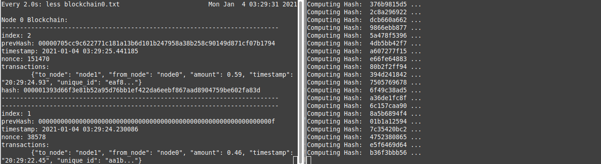
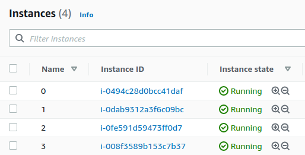
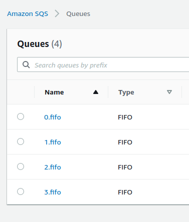
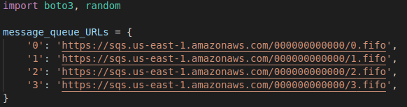

# Proof-of-Work Blockchain



A proof-of-work blockhain implementation written in Python by Amy Peerlinck and Matteo Bjornsson.

**The Blockchain**
---
This blockchain network is constrained to a narrow scope for the purpose of demonstration, but could in theory be expanded to a much larger number of nodes. All nodes have a message queue that is known by every node (read: hardcoded queue addresses). Here the nodes are four Amazon EC2 instances that communicate using Amazon Simple Queue Service queues. An interesting extension of this code would be to enable adding and removing nodes to the live network. 

This implementation, at scale, would in theory achieve the  probabilistically immutable ledger guaranteed by, and desired of, any blockchain. 

Some notes on this blockchain:
* Nodes  accept transactions sent to the network, mine them into a block by finding a nonce that satisfies the hash difficulty, and send the mined blocks to the rest of the network. In this case the node network is completely connected. 
* SHA-256 hash is used for proof of work. The hash difficulty is set by the required number of leading zeros in the hash.
* Blocks consist of an index, previous hash, timestamp, nonce, transactions, and hash. 
* The blockchain and ledger must be written to permenant storage so that nodes can crash and rejoin the network seamlessly. 
* Nodes mine on the longest blockchain. If a longer chain is discovered, the current chain is abandoned and the node begins mining on the longest chain. 
* Only valid transactions are accepted by the network (no double spending). A valid transaction is defined here as one that does not cause a node's balance to drop below zero. 

**Setup and Dependencies**
---
This code depends on the Amazon [AWS SDK for Python (Boto 3)](https://aws.amazon.com/sdk-for-python/)
```bash
pip install boto3
```
This project was designed to run on AWS EC2 instances. However, as long as the Amazon SQS queues are set up, these four nodes could just as well be run all on a local machine, even in the same directory (the names of the files written do disk differ by the node number). 

```bash
aws configure
```



For anyone still getting used to setting up AWS services, we found the easiest way to get the instance up and running was to install git, clone this repo, install python3, pip install boto3, and finally use the `aws configure` command to set up the instance [aws credentials](https://docs.aws.amazon.com/sdk-for-java/v1/developer-guide/setup-credentials.html). In our case the credentials lived in `~/.aws/credentials`. 

The network runs using Amazon SQS FIFO queues and Content-based deduplication turned on. 



The urls for those queues are hardcoded in `Messenger.py` and `TransactionGenerator.py`. Note that these files assume a certain URL format and that the names of these nodes match the expected scheme of '0', '1', '2', '3', etc. 



**Running the Network**
---
```bash
python3 Node.py 0
```
Each instance is started by running the `Node.py` file with the node ID as a command line argument. If the AWS credentials are set up correctly and the queue URLs are correct, the network will wait for incoming transactions. 

```bash
python3 TransactionGenerator.py
```
This command can be run from any machine that has the AWS credentials set up. This will start sending randomly generated transactions to every node in the network. This file currently sends the transaction to 3 out of 4 nodes randomly to demonstrate that transactions will propagate through the network and intentionally cause some conflicts between nodes to demonstrate self correction. 

```bash
watch cat blockchain0.txt
```
The blockchain is continually printed to file in `blockchain#.txt` for a human readable status on the node's blockchain:

```
Node 0 Blockchain: 
---------------------------------------------------------------------------
index: 18
prevHash: 0000423c1c0a6708a85515294373c463ee266e0678d5cab449c7026f9727e9f5
timestamp: 2020-05-08 08:40:10.680732
nonce: 8550
transactions:
	{
        "to_node": "node2", 
        "from_node": "node3", 
        "amount": 0.13, 
        "timestamp": "2020-05-08 08:40:07.405769", 
        "unique_id": "f6383268404d95beda79dfb7b675b5fadb661a690cdab46215c85798ceec8f44"
        }
hash: 0000823c45c9dad48d7c65a650128c8b9dc368efab706d73657c66b51343e416
---------------------------------------------------------------------------
---------------------------------------------------------------------------
index: 17
prevHash: 00009504e5078d34f2003553d8425077c81f47d9919455f0f17e641adeffe0fc
timestamp: 2020-05-08 08:40:10.055551
nonce: 1164
transactions:
	{
        "to_node": "node2", 
        "from_node": "node3", 
        "amount": 0.13, 
        "timestamp": "2020-05-08 08:40:07.405769", 
        "unique_id": "f6383268404d95beda79dfb7b675b5fadb661a690cdab46215c85798ceec8f44"
        }
hash: 0000423c1c0a6708a85515294373c463ee266e0678d5cab449c7026f9727e9f5
---------------------------------------------------------------------------
---------------------------------------------------------------------------
index: 16
prevHash: 00000ba01eb6ec391cede69aa2636148267ab21d7b86dc54d49f94847db436e6
timestamp: 2020-05-08 08:40:08.612753
nonce: 20947
transactions:
	{
        "to_node": "node2", 
        "from_node": "node3", 
        "amount": 0.13, 
        "timestamp": "2020-05-08 08:40:07.405769", 
        "unique_id": "f6383268404d95beda79dfb7b675b5fadb661a690cdab46215c85798ceec8f44"
        }
hash: 00009504e5078d34f2003553d8425077c81f47d9919455f0f17e641adeffe0fc
---------------------------------------------------------------------------
---------------------------------------------------------------------------
index: 15
prevHash: 00003dacd48c04de6ecb6d049ebd2c12d6e56d425f1b6392fcc3719bd6a01667
timestamp: 2020-05-08 08:40:02.965587
nonce: 33022
transactions:
	{
        "to_node": "node3", 
        "from_node": "node2", 
        "amount": 0.68, 
        "timestamp": "2020-05-08 08:40:02.201761", 
        "unique_id": "0b31887675c5d82241999c6e17294d163d9904bf829287ad8b6f689b4ba4d98f"
        }
hash: 00000ba01eb6ec391cede69aa2636148267ab21d7b86dc54d49f94847db436e6
------------------------------------------------------------------------

...

```
**Video**
---
If you are still here, [this](https://www.youtube.com/watch?v=37zh4TbVYt8) is a video walking through the running blockchain and code. 
